# AI消费纠纷证据整理助手

> **AI Consumer Dispute Evidence Organizer** — a local, human-in-the-loop MVP that turns fictional consumer-dispute materials into traceable evidence structures and reviewable document drafts.

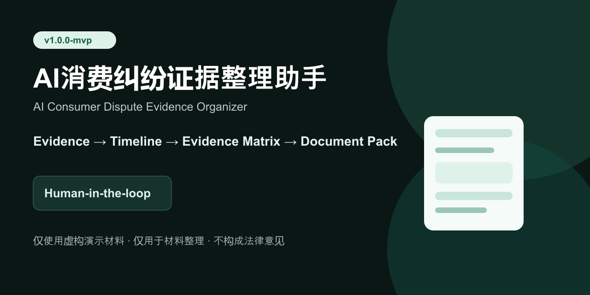

**v1.0.0-mvp · MVP 已完成 · 本地演示 · 未商业化**

将付款订单、服务合同、聊天记录和商家信息等材料，整理为经用户确认、能回溯原始证据的时间线、事实—证据矩阵、材料缺口清单和文档草稿。**本项目仅用于材料整理与作品展示，不构成法律意见，不判断违法，不预测退款、投诉或诉讼结果。**

## 项目背景

预付式消费争议的材料常分散在订单、合同、聊天记录和商家信息中。普通用户难以建立清晰的事实顺序，也容易把自己的陈述和客观证据混在一起；复核人员则要先做大量重复的材料预处理。

本项目以“先让材料可核对，再让用户决定事实”为原则，做成一个可完整本地演示的求职作品集 MVP。

## 解决方案：8 步可追溯流程

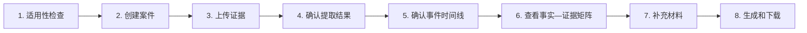

系统以服务端统一派生状态驱动上述步骤；缺少关键技术前置条件时明确引导，普通材料缺口则保留为可解释的软提醒。

## 核心能力

- 一套可重复初始化的虚构演示案件：**8 份** PNG/PDF/TXT 证据与 **18 项** Mock 提取结果。
- 人工确认机制：提取值必须确认、修改、删除或标记无法确认后才进入后续事实整理。
- 事件时间线与原始证据回链；没有原始材料支持的内容明确标记为“用户陈述”。
- 字段确认状态与证据支持状态分离，避免把“填写了”误当作“材料已证明”。
- 事实—证据矩阵与材料缺口检查，不输出违法判断或成功率。
- USER、REVIEWER、ADMIN 三角色服务端授权、案件所有权与复核分配隔离。
- 6 份中文 PDF 与 3 个 ZIP 材料包；所有内容都是“草稿，请核对”。
- 私有文件访问、审计摘要与级联数据删除。

## 产品截图（全部为虚构演示数据）

<p align="center">
  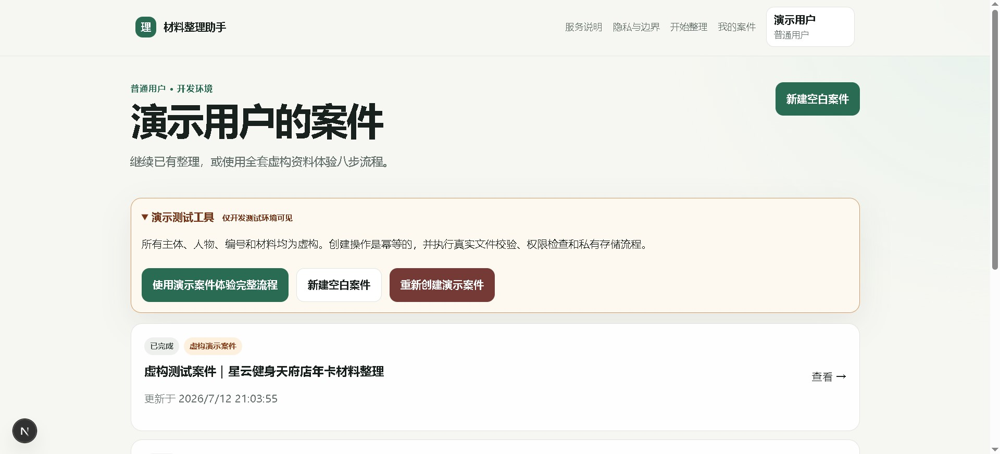
  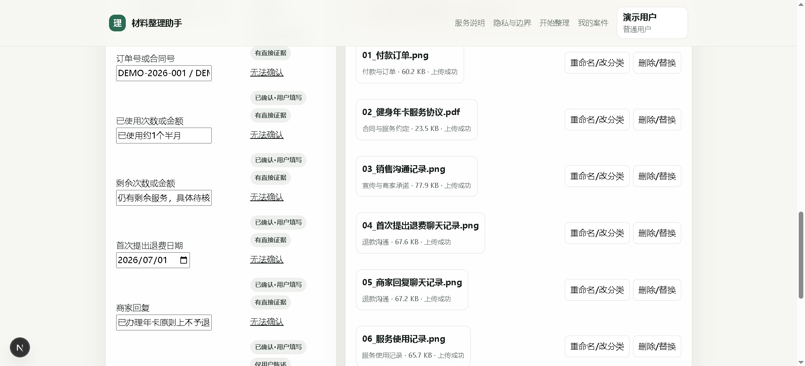
</p>
<p align="center">
  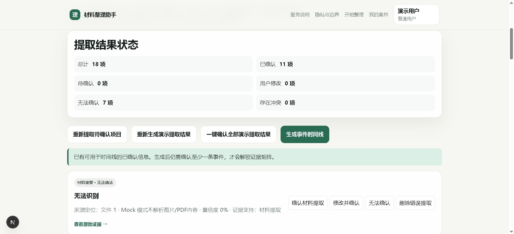
  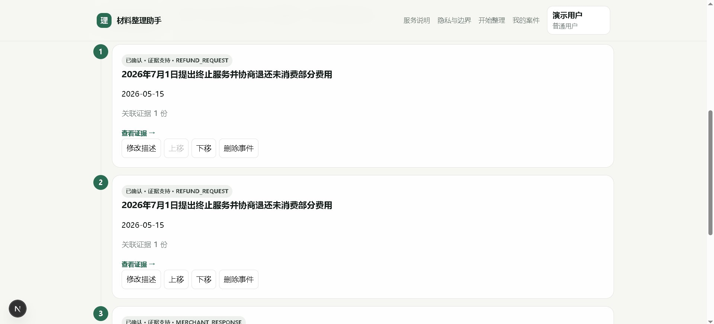
</p>
<p align="center">
  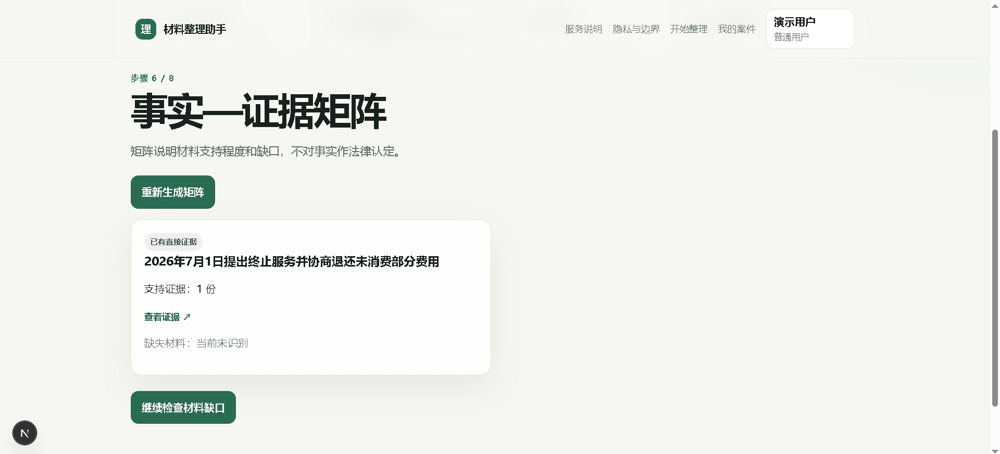
  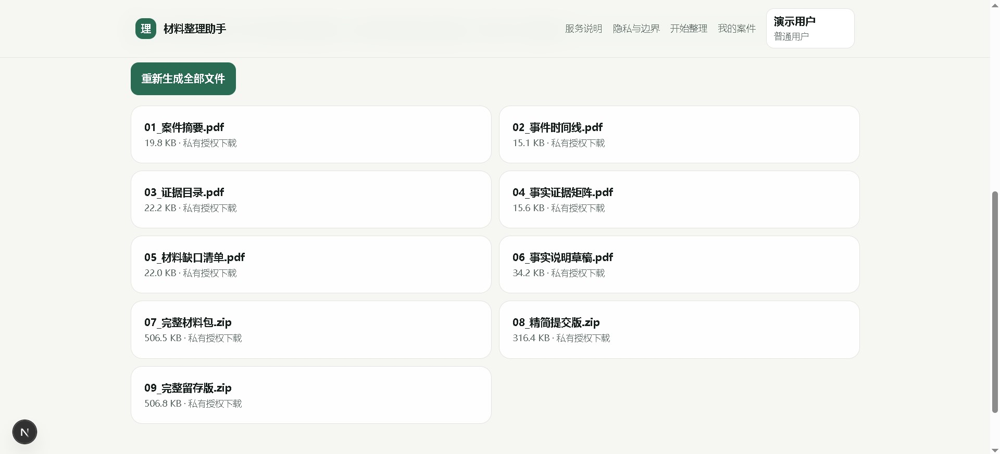
</p>

移动端验证：

<p align="center">
  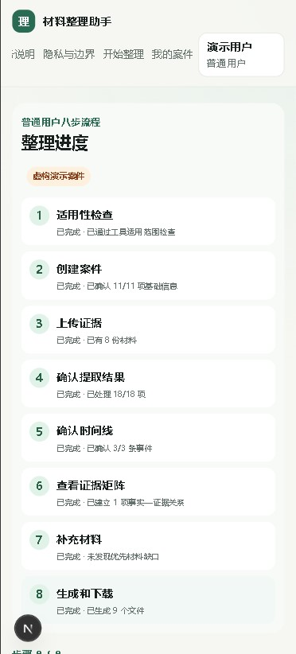
  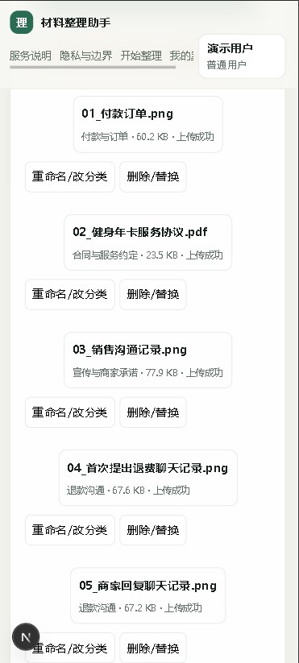
</p>

截图展示的是 `user@demo.local` 的虚构演示数据；未包含密码、本地路径、真实个人信息或真实争议材料。

## AI 工作流


演示环境使用 Mock Provider；OCR 与模型接口以适配层隔离。模型结果不是最终事实：不确定字段返回 `null`，关键结果必须人工确认，每个事件必须关联证据或明确标记用户陈述。详见 [AI 工作流说明](docs/AI_WORKFLOW.md)。

## 系统架构

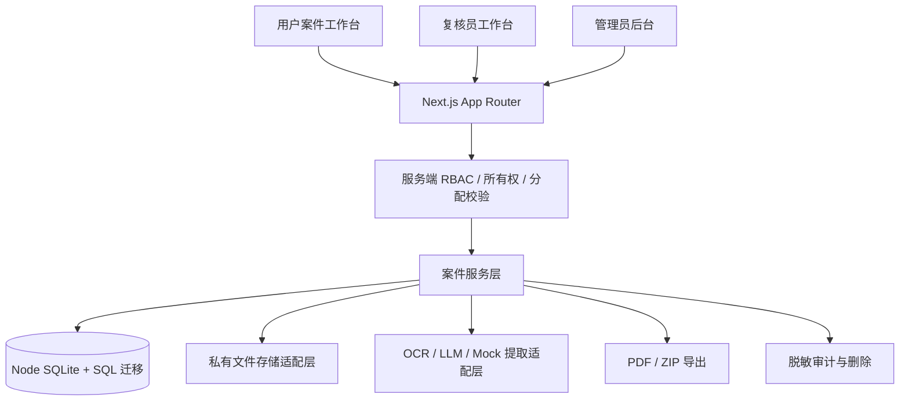

项目当前使用 Node 内置 SQLite，**不使用 Prisma**；这是本地测试版的明确取舍。生产化前需替换为受审查的数据库和私有对象存储，详见 [架构说明](docs/ARCHITECTURE.md)。

## 关键产品设计

- **不做 AI 律师**：只整理材料，不生成法律结论、违法认定或结果预测。
- **不直接提交投诉**：输出需要用户核对的材料草稿，不连接政府平台。
- **Human-in-the-loop**：AI/Mock 输出先绑定来源、定位和置信度，再由用户确认。
- **状态与证据分离**：确认来源、用户编辑与证据支持是两个独立维度。
- **三角色体系**：用户管理自己的材料；复核员仅看分配案件；管理员负责测试分配与脱敏审计。
- **Mock-first 演示**：无外部 OCR、LLM、支付或对象存储密钥，也能复现完整流程。

## 可验证成果

| 指标 | 当前 MVP |
| --- | --- |
| 角色 | 3 种：USER、REVIEWER、ADMIN |
| 用户流程 | 8 步 |
| 演示证据 | 8 份虚构材料 |
| 结构化提取 | 18 项 Mock 结果 |
| 导出 | 6 份 PDF + 3 个 ZIP |
| 演示方式 | 完整本地流程 |

不展示用户数量、收入、准确率或节省时间等未经验证的商业指标。

## 本地运行

要求：Node.js 24（最低 22.5）与 npm 11。Linux CI 需安装 `fonts-noto-cjk`；Windows 本地演示已验证。

```bash
npm ci
copy .env.example .env.local
npm run db:migrate
npm run db:seed
npm run demo:generate-assets
npm run demo:seed
npm run auth:doctor
npm run demo:doctor
npm run dev
```

访问 `http://localhost:3000`。开发账号仅用于虚构数据，密码从本机 `.env.local` 的 `DEV_USER_PASSWORD`、`DEV_REVIEWER_PASSWORD`、`DEV_ADMIN_PASSWORD` 读取；不要把本机密码提交到仓库。`.env.example` 只包含开发占位值，复制后请修改 `DEV_AUTH_SECRET` 和三个密码，并再次运行 `npm run db:seed`。

`DEMO_MODE_ENABLED=true` 且非生产环境时，普通用户可创建或恢复 `prepaid-gym-v1` 演示案件。它会加载 8 份虚构材料和 18 项待确认提取结果；生产环境强制拒绝演示接口。

更多操作见 [演示指南](docs/DEMO_GUIDE.md) 与 [截图指南](docs/SCREENSHOT_GUIDE.md)。

## 测试与质量门禁

```bash
npm run auth:doctor
npm run demo:doctor
npm run lint
npm run typecheck
npm run test
npm run test:integration
npm run test:e2e
npm run build
```

最新已验证结果：全量 Vitest **21 文件 / 64 测试**，集成测试 **7 文件 / 23 测试**，端到端测试 **3 文件 / 6 测试**。完整记录见 [测试报告](docs/TEST_REPORT.md)。

## 已知限制

- 仅覆盖预付式消费服务的材料整理场景。
- 仅使用虚构演示材料，未接入正式 OCR、LLM、支付或政府平台。
- 未经法律专业机构、隐私合规或生产安全审查。
- 使用本地 SQLite 与私有本地存储，不建议直接投入生产。

详见 [已知限制](docs/KNOWN_LIMITATIONS.md) 与 [安全和隐私说明](docs/SECURITY_PRIVACY.md)。

## 我在项目中的工作

我负责需求分析、产品定位、PRD、用户流程、状态机、验收规则、AI 边界、安全要求、测试反馈和多轮迭代；使用 Codex 辅助工程实现、自动化测试、调试和文档整理。

## 文档导航

- [项目复盘](docs/CASE_STUDY.md)
- [架构](docs/ARCHITECTURE.md)
- [AI 工作流](docs/AI_WORKFLOW.md)
- [安全与隐私](docs/SECURITY_PRIVACY.md)
- [测试报告](docs/TEST_REPORT.md)
- [面试指南](docs/INTERVIEW_GUIDE.md)
- [简历要点](docs/RESUME_BULLETS.md)
- [发布检查清单](docs/PUBLISH_CHECKLIST.md)
- [GitHub 仓库设置](docs/GITHUB_REPOSITORY_SETUP.md)

## 许可

本仓库暂不附带开源许可证，仅作为公开求职作品展示。除适用法律另有规定外，公开查看不等同于获得复制、修改或再分发授权。
