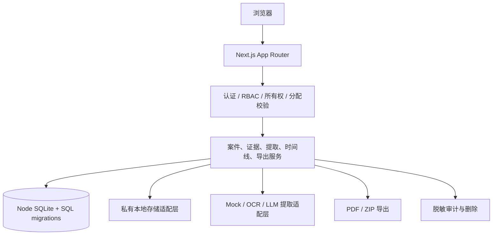

# 架构说明

> 本文描述 `v1.0.0-mvp` 的本地作品集架构。当前使用 Node SQLite，不使用 Prisma；生产化前必须重新审查。

## 结构

- Next.js App Router：移动端页面、Route Handlers 和 Server Actions。
- TypeScript + Zod：共享输入/输出契约，尤其约束 OCR/模型结果。
- `node:sqlite`：测试版嵌入式数据库；`db/migrations` 保存可执行 SQL 迁移。
- 仓储/服务层：权限、案件、证据、提取、生成、删除逻辑与页面解耦。
- StorageAdapter：测试版私有本地文件系统，预留 S3 兼容实现。
- ExtractionAdapter：Mock 为默认实现，预留 OCR/模型提供商适配器。
- ExportAdapter：生成中文 PDF 与 ZIP；字体路径可配置。

## 信任边界

浏览器和上传文件均不可信。Route Handler 先认证，再校验角色与资源关系，随后校验输入。原始证据不进入日志；证据中的指令不参与系统提示。下载由权限校验后的短期、不可猜测令牌或受保护 Route Handler 返回。

## 数据流

上传原文件 → 私有存储与哈希 → 分类 → 适配器提取 → Zod 校验 → 待确认记录 → 用户确认 → 时间线/矩阵/缺口规则 → 草稿 → 导出。任何未确认关键字段只可出现在“待确认”区域。

## 生产迁移

正式上线前需将 SQLite 仓储实现替换为 PostgreSQL，执行并发/事务回归；本地存储替换为私有 S3 兼容存储；接入真实 OCR/模型前完成供应商数据处理评估与脱敏验证。接口边界保持不变。
